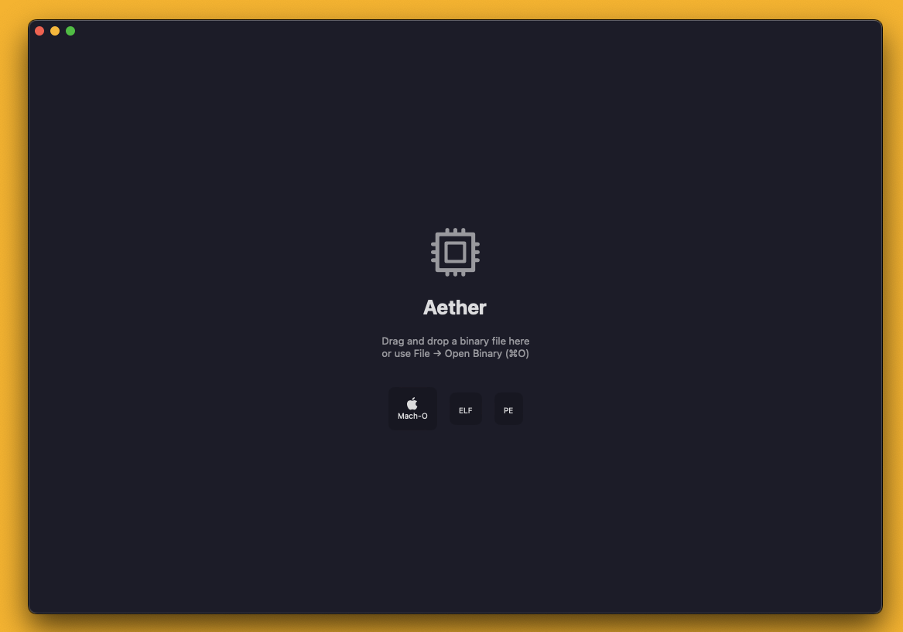
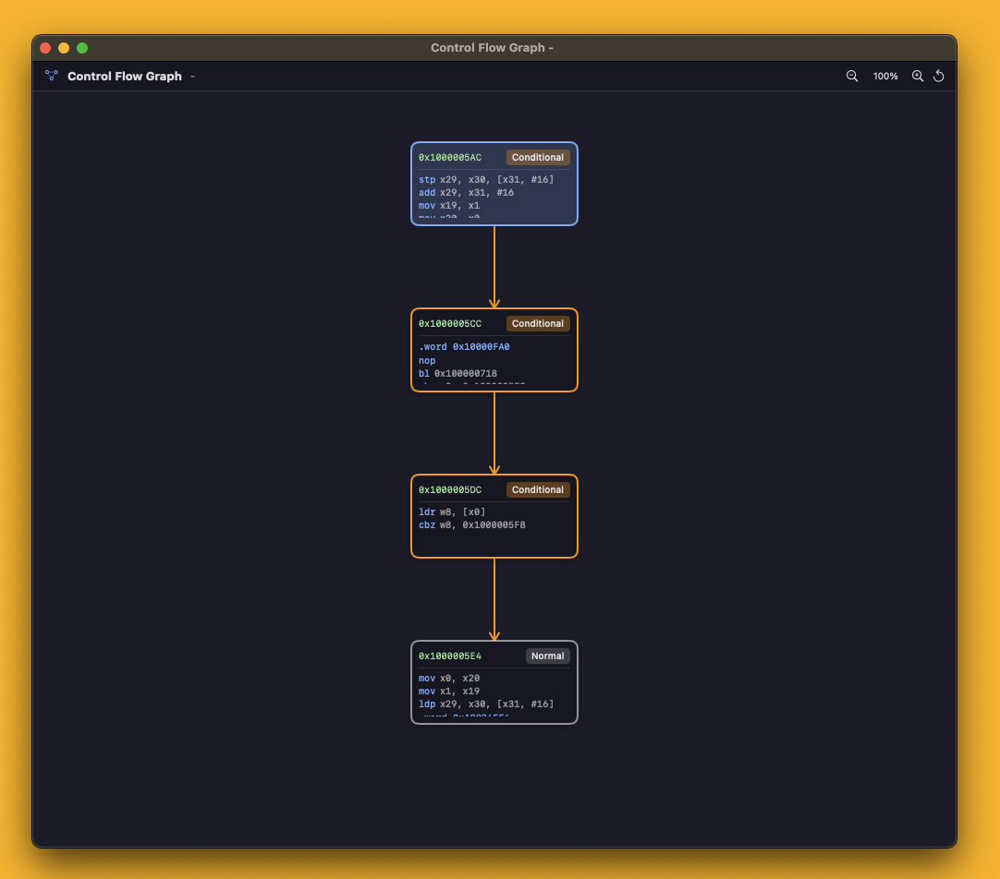
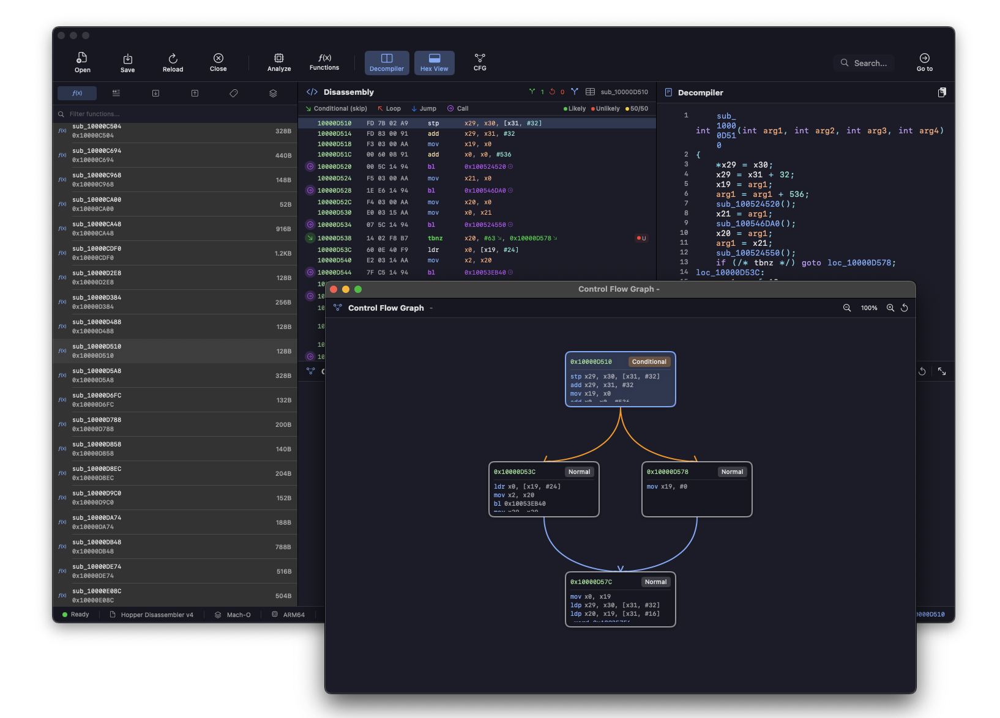
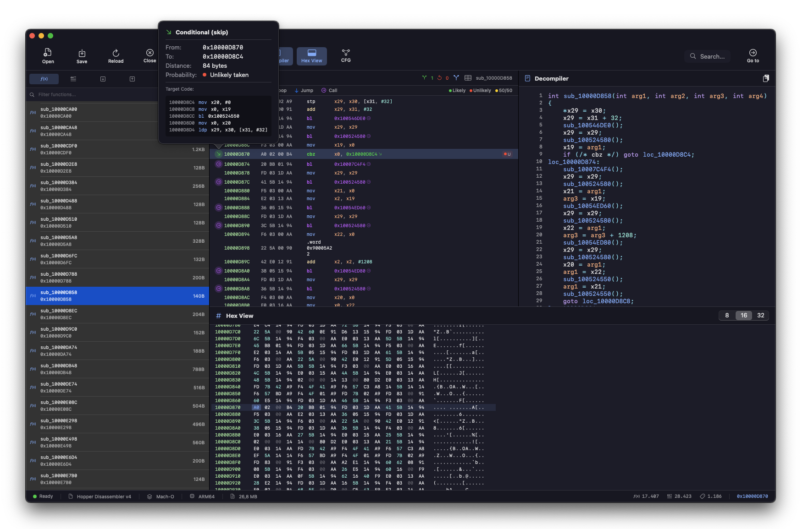

# Aether

<p align="center">
  
</p>

<p align="center">
  <a href="https://github.com/Pinperepette/Aether/releases/download/v1.1.6/Aether.dmg">
    
  </a>
  
  
  <a href="LICENSE">
    
  </a>
</p>

**Aether** is a native macOS disassembler built with Swift and SwiftUI. It breaks down binaries into their purest essence — just like the ancient Greek element that permeated the cosmos.

> *"Beyond the binary, into the essence."*

## Download

**[Download Aether v1.1.6](https://github.com/Pinperepette/Aether/releases/download/v1.1.6/Aether.dmg)** — macOS 14.0 (Sonoma) or later

## What's New in v1.1.6

### AI Security Analysis (Claude Integration)
- **Claude AI Integration**: Optional AI-powered security analysis using your Claude API key
- **Bypass Detection**: Identifies license checks, trial limitations, and anti-piracy mechanisms
- **Patch Points**: Suggests specific addresses and techniques for bypassing protections
- **Security Mechanisms**: Detects code signing, integrity checks, network validation
- **Hardcoded Secrets**: Finds obfuscated strings, API keys, and encryption keys
- **Detailed Reports**: Findings with severity levels (Critical/High/Medium/Low/Info)
- **Secure Storage**: API key stored in macOS Keychain (never in app bundle)

### How to Use AI Analysis
1. Go to Settings (⌘,) → AI tab
2. Enter your Claude API key from console.anthropic.com
3. Click "AI Analysis" in toolbar → Analyze Function or Analyze Binary
4. Review findings, bypass techniques, and patch points

<p align="center">
  
</p>
<p align="center">
  
</p>

## What's New in v1.1.5

### Performance & Stability
- **Async File Loading**: Binary loading now runs on background thread for responsive UI
- **No More Beach Ball**: Large binaries load without freezing the interface
- **Removed Debug Logging**: Faster parsing and reduced memory usage

### Java Decompiler
- **Full Java Bytecode Support**: Decompile JAR files and Java class files
- **Stack Simulation**: Accurate bytecode interpretation
- **Method Signatures**: Proper parsing of Java type descriptors

### UI Improvements
- **Cleaner Toolbar**: Removed redundant function name display
- **Better Function Names**: Improved formatting for Java method signatures in sidebar

## What's New in v1.1.4

### Enhanced Decompiler
- **Control Flow Recovery**: Integrated ControlFlowStructurer for proper structure recovery (if/else, while, for loops)
- **String Literal Detection**: New string cache system for better string recognition in decompiled code
- **Improved Type Inference**: Better inference for parameters, local variables and return types
- **Prologue/Epilogue Detection**: Automatically skip boilerplate function setup code
- **Smart Condition Building**: Combines compare+jump patterns into readable conditions
- **Better Variable Names**: Improved register to variable name mapping for both x86_64 and ARM64
- **Enhanced Operations**: Full support for increment, decrement, logic and arithmetic operations

## What's New in v1.1.3

### Conditional Jumps Patcher
- **New Conditional Jumps View**: View and patch conditional jumps (JZ, JNZ, JE, JNE, etc.)
- **Flip Jump Conditions**: Easily invert conditional jumps with one click
- **Support for all x86 conditionals**: Both short (7x) and long (0F 8x) jump opcodes
- **Search and Filter**: Find specific jumps by address or mnemonic

## What's New in v1.1.2

### Bug Fixes
- **Fixed crash with -128 displacement**: Int8 overflow bug that caused SIGILL crash when disassembling instructions like `lea rdi, [rbp-0x80]`
- **Added bounds checking**: Safe array access for register names and condition codes
- **Improved stability**: Better handling of large binaries and edge cases

## What's New in v1.1.1

### Branch Visualization
- **Branch Arrows**: Color-coded arrows showing jump directions
  - 🟢 Green: Conditional forward jumps (skip code)
  - 🔴 Red: Conditional backward jumps (loops)
  - 🔵 Blue: Unconditional forward jumps
  - 🟠 Orange: Unconditional backward jumps
  - 🟣 Purple: Function calls
- **Jump Table View**: Panel listing all jumps with filtering and sorting (⇧⌘J)
- **Inline Target Preview**: Hover over jumps to see target code
- **Branch Probability**: Estimated probability (Likely/Unlikely/50-50)
- **Branch Statistics**: Summary of branches in disassembly header

## What's New in v1.1.0

### Advanced Analysis Features
- **Pseudo-Code Generation**: Convert assembly to structured C-like code with if/else, while, for loops
- **Call Graph Visualization**: Interactive graph showing function call relationships with multiple layouts (hierarchical, radial, force-directed)
- **Crypto Detection**: Automatically detect cryptographic algorithms (AES, SHA, RSA, etc.) by signature matching
- **Deobfuscation Analysis**: Detect obfuscation techniques (control flow flattening, opaque predicates, junk code)
- **Type Recovery**: Infer data types (structs, arrays, enums) from memory access patterns
- **Idiom Recognition**: Recognize common code patterns (strlen, memcpy, multiplication via shifts)

### Export Formats
- **IDA Python Script**: Export analysis to IDA Pro format
- **Ghidra XML**: Export to Ghidra project format
- **Radare2 Script**: Export to r2 commands
- **Binary Ninja Script**: Export to Binary Ninja format
- **JSON/CSV/HTML/Markdown**: Multiple report formats
- **C Header**: Generate header files with function signatures

### Other Improvements
- **Data Flow Analysis**: Def-use chains, reaching definitions, constant propagation
- **AI Annotator**: Suggest function names and comments based on behavior analysis
- **Lightweight Emulator**: Trace execution for x86-64

## Features

### Core Features
- **Multi-Architecture Support**: ARM64 and x86_64
- **Multiple Binary Formats**: Mach-O, ELF, PE/COFF, JAR/Java Class
- **Modern UI**: Native SwiftUI interface with dark mode
- **Disassembly View**: Syntax-highlighted assembly with address navigation
- **Hex View**: Synchronized hex dump viewer
- **Control Flow Graph (CFG)**: Visual representation of code flow
- **Decompiler**: Pseudo-C code generation
- **Function Analysis**: Automatic function detection and naming
- **String Analysis**: Extract and navigate to strings
- **Cross-References**: Track code and data references
- **Symbol Support**: Full symbol table parsing
- **Project System**: Save and restore analysis sessions

### Analysis Menu
| Feature | Shortcut | Description |
|---------|----------|-------------|
| Analyze All | ⇧⌘A | Run full binary analysis |
| Find Functions | ⇧⌘F | Detect and list all functions |
| Show CFG | ⌘G | Display control flow graph |
| Decompile | ⇧⌘D | Generate decompiled code |
| Generate Pseudo-Code | ⇧⌘P | Generate structured pseudo-code |
| Call Graph | ⌘K | Show interactive call graph |
| Crypto Detection | - | Detect cryptographic algorithms |
| Deobfuscation Analysis | - | Analyze obfuscation techniques |
| Type Recovery | - | Recover data types |
| Idiom Recognition | - | Recognize code patterns |
| Show Jump Table | ⇧⌘J | View all branches and jumps |

### Export Menu
| Format | Description |
|--------|-------------|
| IDA Python | Script for IDA Pro |
| Ghidra XML | Project file for Ghidra |
| Radare2 | r2 command script |
| Binary Ninja | Python script for BN |
| JSON | Structured data export |
| CSV | Spreadsheet-compatible |
| HTML | Web report with styling |
| Markdown | Documentation format |
| C Header | Function declarations |

## Screenshots

<p align="center">
  
</p>

<p align="center">
  
</p>


## Installation

### Download DMG (Recommended)

1. Download [Aether.dmg](https://github.com/Pinperepette/Aether/releases/download/v1.1.6/Aether.dmg)
2. Open the DMG and drag Aether to Applications
3. Launch Aether from Applications

### Build from Source

```bash
git clone https://github.com/Pinperepette/Aether.git
cd Aether
swift build -c release
```

The built application will be available at `.build/release/Aether`.

## Usage

1. **Open a binary**: Drag and drop a file onto the window, or use `File → Open Binary` (⌘O)
2. **Navigate**: Click on functions in the sidebar to jump to their code
3. **Analyze**: Use `Analysis → Analyze All` (⇧⌘A) for full analysis
4. **View CFG**: Select a function and press ⌘G to see the control flow graph
5. **Decompile**: Press ⇧⌘D to generate pseudo-C code
6. **Pseudo-Code**: Press ⇧⌘P to generate structured pseudo-code
7. **Call Graph**: Press ⌘K to view function call relationships
8. **Export**: Use the Export menu to save analysis in various formats

### Keyboard Shortcuts

| Action | Shortcut |
|--------|----------|
| Open Binary | ⌘O |
| Close | ⌘W |
| Go to Address | ⇧⌘G |
| Search | ⌘F |
| Analyze All | ⇧⌘A |
| Find Functions | ⇧⌘F |
| Show CFG | ⌘G |
| Decompile | ⇧⌘D |
| Pseudo-Code | ⇧⌘P |
| Call Graph | ⌘K |
| Jump Table | ⇧⌘J |

## Supported Formats

| Format | Extensions | Architectures |
|--------|------------|---------------|
| Mach-O | (various) | ARM64, x86_64 |
| ELF | .so, .elf, (none) | ARM64, x86_64 |
| PE/COFF | .exe, .dll | x86, x86_64 |
| Java | .jar, .class | JVM Bytecode |

## Architecture

```
Aether/
├── App/           # Application entry point and state management
├── Core/
│   ├── Binary/    # Binary format loaders (Mach-O, ELF, PE, JAR)
│   ├── Disassembler/  # Disassembly engine
│   ├── Analysis/  # Function, string, xref, crypto, type analysis
│   ├── Decompiler/    # Pseudo-code generation
│   └── Emulation/     # Lightweight CPU emulator
├── UI/            # SwiftUI views and components
│   ├── GraphView/     # CFG and Call Graph visualization
│   └── AnalysisViews/ # Analysis result views
├── Models/        # Data models
└── Services/      # Export manager, plugin system, scripting
```

## Contributing

Contributions are welcome! Please feel free to submit a Pull Request.

## License

This project is licensed under the MIT License - see the [LICENSE](LICENSE) file for details.

---

<p align="center">
  <b>Aether</b> — Peel back the layers. See the code beneath.
</p>
