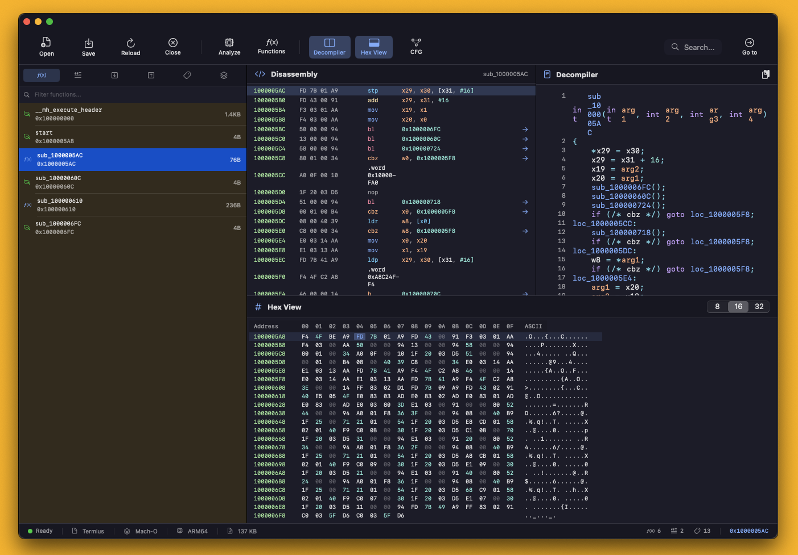

# Aether

<p align="center">
  
</p>

<p align="center">
  <a href="https://github.com/Pinperepette/Aether/releases/download/v1.0.0/Aether.dmg">
    
  </a>
  
  
  <a href="LICENSE">
    
  </a>
</p>

**Aether** is a native macOS disassembler built with Swift and SwiftUI. It breaks down binaries into their purest essence — just like the ancient Greek element that permeated the cosmos.

> *"Beyond the binary, into the essence."*

## Download

**[Download Aether v1.0.0](https://github.com/Pinperepette/Aether/releases/download/v1.0.0/Aether.dmg)** — macOS 14.0 (Sonoma) or later

## Features

- **Multi-Architecture Support**: ARM64 and x86_64
- **Multiple Binary Formats**: Mach-O, ELF, PE/COFF, JAR/Java Class
- **Modern UI**: Native SwiftUI interface with dark mode
- **Disassembly View**: Syntax-highlighted assembly with address navigation
- **Hex View**: Synchronized hex dump viewer
- **Control Flow Graph (CFG)**: Visual representation of code flow
- **Decompiler**: Pseudo-C code generation
- **Function Analysis**: Automatic function detection and naming
- **String Analysis**: Extract and navigate to strings
- **Cross-References**: Track code and data references
- **Symbol Support**: Full symbol table parsing
- **Project System**: Save and restore analysis sessions

## Screenshots

<p align="center">
  
</p>

<p align="center">
  
</p>

## Installation

### Download DMG (Recommended)

1. Download [Aether.dmg](https://github.com/Pinperepette/Aether/releases/download/v1.0.0/Aether.dmg)
2. Open the DMG and drag Aether to Applications
3. Launch Aether from Applications

### Build from Source

```bash
git clone https://github.com/Pinperepette/Aether.git
cd Aether
swift build -c release
```

The built application will be available at `.build/release/Aether`.

## Usage

1. **Open a binary**: Drag and drop a file onto the window, or use `File → Open Binary` (⌘O)
2. **Navigate**: Click on functions in the sidebar to jump to their code
3. **Analyze**: Use `Analysis → Analyze All` (⇧⌘A) for full analysis
4. **View CFG**: Select a function and press ⌘G to see the control flow graph
5. **Decompile**: Press ⇧⌘D to generate pseudo-C code

### Keyboard Shortcuts

| Action | Shortcut |
|--------|----------|
| Open Binary | ⌘O |
| Close | ⌘W |
| Go to Address | ⇧⌘G |
| Search | ⌘F |
| Analyze All | ⇧⌘A |
| Find Functions | ⇧⌘F |
| Show CFG | ⌘G |
| Decompile | ⇧⌘D |

## Supported Formats

| Format | Extensions | Architectures |
|--------|------------|---------------|
| Mach-O | (various) | ARM64, x86_64 |
| ELF | .so, .elf, (none) | ARM64, x86_64 |
| PE/COFF | .exe, .dll | x86, x86_64 |
| Java | .jar, .class | JVM Bytecode |

## Architecture

```
Aether/
├── App/           # Application entry point and state management
├── Core/
│   ├── Binary/    # Binary format loaders (Mach-O, ELF, PE, JAR)
│   ├── Disassembler/  # Disassembly engine
│   ├── Analysis/  # Function, string, and xref analysis
│   └── Decompiler/    # Pseudo-code generation
├── UI/            # SwiftUI views and components
├── Models/        # Data models
└── Services/      # Plugin system, scripting engine
```

## Contributing

Contributions are welcome! Please feel free to submit a Pull Request.

## License

This project is licensed under the MIT License - see the [LICENSE](LICENSE) file for details.

---

<p align="center">
  <b>Aether</b> — Peel back the layers. See the code beneath.
</p>
